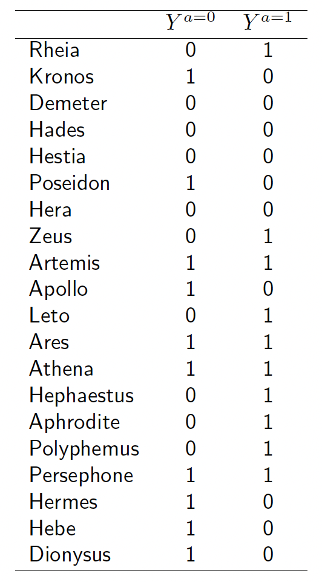
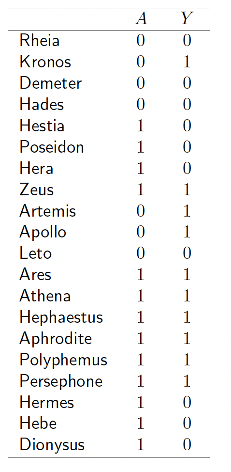
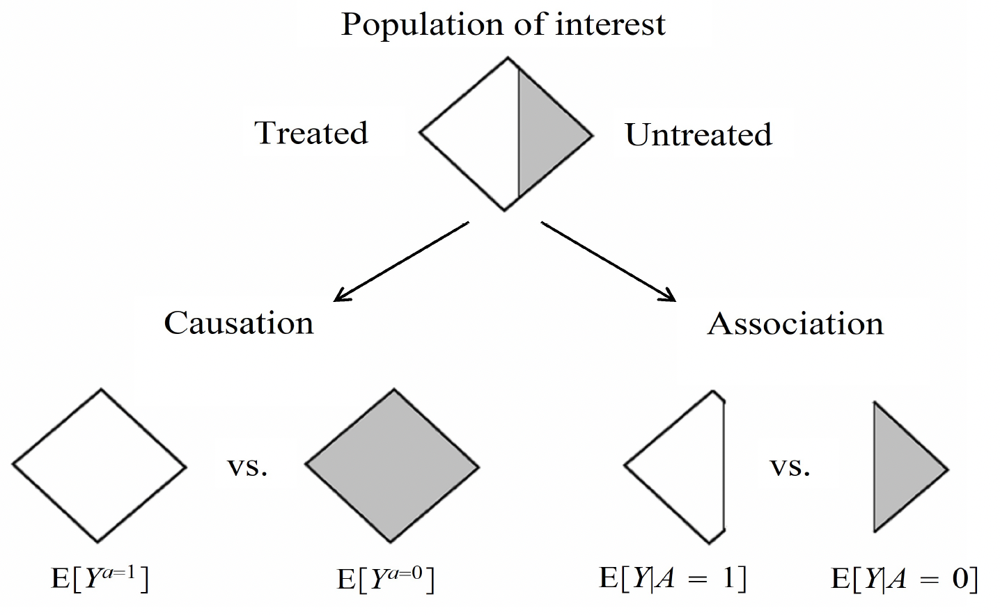
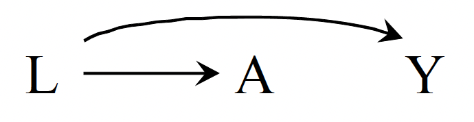
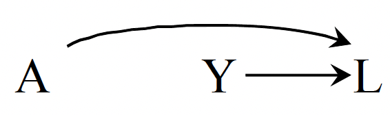
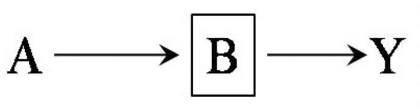
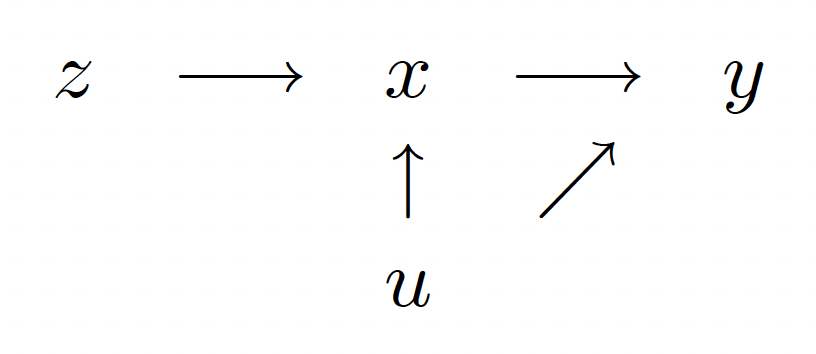

# Causality

# Definitions

## Notation
Let $Y^{a=1}$ (read $Y$ under treatment $a=1$) be the outcome variable that would have been observed under the treatment value $a=1$, and $Y^{a=0}$ (read $Y$ under treatment $a = 0$) the outcome variable that would have been observed under $A$ the treatment value $a = 0$.

We can now provide a formal definition of a causal effect for an individual: The treatment $A$ has a __causal effect__ on an individual's outcome $Y$ if $Y^{a=1} \ne Y^{a=0}$ for the individual.

The variables $Y^{a=1}$ and $Y^{a=0}$ are referred to as __potential outcomes__ or as __counterfactual outcomes__.

 

For each individual, one of the counterfactual outcomes -- the one that corresponds to the treatment value that the individual did receive -- is actually factual. For example, because Zeus was actually treated $(A = 1)$, his counterfactual outcome under treatment $Y^{a=1} = 1$ is equal to his observed (actual) outcome $Y = 1$. That is, an individual with observed treatment $A$ equal to $a$, has observed outcome $Y$ equal to his counterfactual outcome $Y^a$. This equality can be succinctly expressed as $Y=Y^A$ where $Y^A$ denotes the counterfactual $Y^a$ evaluated at the value $a$ corresponding to the individual's observed treatment $A$. The equality $Y=Y^A$ is referred to as __consistency__.

Consistency: if $A_i = a$, then $Y^a_i = Y^A_i = Y_i$.

Individual causal effects are de ned as a contrast of the values of counterfactual outcomes, but only one of those outcomes is observed for each individual| the one corresponding to the treatment value actually experienced by the individual. All other counterfactual outcomes remain unobserved.

## Causation versus association
When the proportion of individuals who develop the outcome in the treated $Pr[Y = 1|A = 1]$ equals the proportion of individuals who develop the outcome in the untreated $Pr[Y = 1|A = 0]$, we say that treatment $A$ and outcome $Y$ are __independent__ $(A \mathrel{\unicode{x2AEB}} Y)$, that $A$ is not associated with $Y$.

## Randomized experiments

## Observational studies

## Interventions

## Interaction
Suppose you know that carrying a lighter $A$ has no causal effect (causative or preventive) on anyone’s risk of lung cancer $Y$, i.e., $Pr[Y^{a=1} = 1] = Pr[Y^{a=0} = 1]$, and that cigarette smoking $L$ has a causal effect on both carrying a lighter $A$ and lung cancer $Y$. The causal diagram bellow is the graphical translation of this knowledge.

The lack of an arrow between $A$ and $Y$ indicates that carrying a lighter does not have a causal effect on lung cancer; $L$ is depicted as a common cause of $A$ and $Y$.

__Association__, unlike causation, is a symmetric relationship between two variables (an edge without direction); thus, when present, association flows between two variables regardless of the direction of the causal arrows.

We know that carrying a lighter $A$ has no causal effect on lung cancer $Y$. The question now is whether carrying a lighter $A$ is associated with lung cancer $Y$. That is, we know that $Pr[Y^{a=1} = 1] = Pr[Y^{a=0} = 1]$ but is it also true that $Pr[Y = 1 | A = 1] = Pr[Y = 1 | A = 0]$?

We learn that Hera is carrying a lighter. But if Hera is carrying a lighter $(A = 1)$, then it is more likely that she is a smoker $(L=1)$, and therefore she has a greater than average risk of developing lung cancer $(Y= 1)$. We then intuitively conclude that $A$ and $Y$ are expected to be associated because the cancer risk in those carrying a lighter $(A=1)$ is different from the cancer risk in those not carrying a lighter $(A=0)$, or $Pr[Y = 1|A = 1] \ne Pr[Y = 1|A = 0]$. In other words, having information about the treatment $A$ improves our ability to predict the outcome $Y$, even though $A$ does not have a causal effect on $Y$. The investigator will make a mistake if he concludes that $A$ has a causal effect on $Y$ just because $A$ and $Y$ are associated. Causal graphs theory again confirms our intuition. In graphic terms, $A$ and $Y$ are associated because there is a flow of association from $A$ to $Y$ (or, equivalently, from $Y$ to $A$) through the common cause $L$.

## collider

Suppose you know that certain genetic haplotype $A$ has no causal effect on anyone’s risk of becoming a cigarette smoker $Y$, i.e., $Pr[Y^{a=1} = 1] = Pr[Y^{a=0} = 1]$, and that both the haplotype $A$ and cigarette smoking $Y$ have a causal effect on the risk of heart disease $L$. The causal diagram bellow is the graphical translation of this knowledge.

The lack of an arrow between $A$ and $Y$ indicates that the haplotype does not have a causal effect on cigarette smoking, and $L$ is depicted as a common effect of $A$ and $Y$. The common effect $L$ is referred to as a __collider__ on the path $A \rightarrow L \leftarrow Y$ because two arrowheads collide on this node.

Now lets check whether A and Y are associated.
Learning about the haplotype $A$ does not improve our ability to predict the outcome $Y$ because the risk in those with $(A=1)$ and without $(A=0)$ the haplotype is the same, or $Pr[Y = 1|A = 1] = Pr[Y = 1|A = 0]$. In other words, we would intuitively conclude that $A$ and $Y$ are not associated, i.e., $A$ and $Y$ are independent or $A \mathrel{\unicode{x2AEB}} Y$.

Causal graphs theory again confirms our intuition because it says that colliders, unlike other variables, block the flow of association along the path on which they lie.

## mediator
Now suppose we obtain an additional piece of information: aspirin $A$ affects the risk of heart disease $Y$ because it reduces platelet aggregation $B$. This new knowledge is translated into the causal diagram of the following Figure  that shows platelet aggregation $B$ (1: high, 0: low) as a mediator of the effect of $A$ on $Y$.

## Confounding
__Confounding__ is the bias due to common causes of treatment and outcome. Bellow is the graph of a treatment $A$, an outcome $Y$, and their shared (or common) cause $L$.

## Selection bias

## propensity score

## Instrumental variables
The instrumental variable $z$ has the property that changes in
$z$ are associated with changes in $x$ but do not led to change in $y$ (aside from the indirect route via $x$). This leads to the following path diagram

which introduces a variable $z$ that is associated with $x$ but not $u$. It is still the case that $z$ and $y$ will be correlated, but the only source of such correlation is the indirect
path of $z$ being correlated with $x$ which in turn determines $y$.

### Examples of an Instrument

### Instrumental Variables Estimator

## counterfactual

## Causality and graphical models

## Causality and graphons

## Causality and mediators

# Casualty vs prediction
Casualty is identification, not prediction.
Predictive models can simply ignore the T variable during their learning process, while T is the most important factor.

# mediators vs moderators
A mediator variable explains the process through which two variables are related, while a moderator variable affects the strength and direction of that relationship.

https://psychdrop.com/2020/04/05/mediation-versus-moderation-whats-the-difference/

Mediators mediate the relationship between X and Y. This occurs by X affecting M leading to M affecting Y, which is called the indirect effect. The direct effect is the relationship between X and Y in the presence of a mediator. Mediation occurs when (1) there is a statistically significant indirect effect (2) the direct effect is smaller than the total effect.

Moderator variables modify the relationship between X and Y. They affect the strength and direction of the relationship between X and Y. That means that X‘s effect on Y can change depending on the moderator.

# mediator vs confounder
A confounder is a third variable that affects variables of interest and makes them seem related when they are not. In contrast, a mediator is the mechanism of a relationship between two variables: it explains the process by which they are related.

Confounders are often demographic variables such as age, gender, and race that typically cannot be changed in an experimental design. Mediators are by definition capable of being changed and are often selected based on malleability. Suppressor variables may or may not be malleable.

# Mediating Variable Examples
According to research and data, the mortality rate of developed countries is lower than in developing countries because of advanced healthcare facilities. So, here, developed countries are the independent variable, the mortality rate is the dependent variable, and the mediator would be better healthcare facilities that navigate the relationship between both.

Being a developed country cannot influence its mortality rate directly. But after introducing the mediator here, which is better health care facilities, we can see an obvious effect of being a developed country and having a low mortality rate.

https://www.statisticshowto.com/mediator-variable/

# Causality and Recommendation system

# Reference
## Books
Causal Inference: What If, Miguel A. Hernán, James M. Robins, December 31, 2020
https://www.hsph.harvard.edu/miguel-hernan/causal-inference-book/

# key people
Miguel Hernan, Kolokotrones Professor of Biostatistics and Epidemiology at Harvard and Broad Institute
https://www.hsph.harvard.edu/profile/miguel-hernan/

## videos
https://www.youtube.com/watch?v=gRkUhg9Wb-I&ab_channel=MITOpenCourseWare

#END
