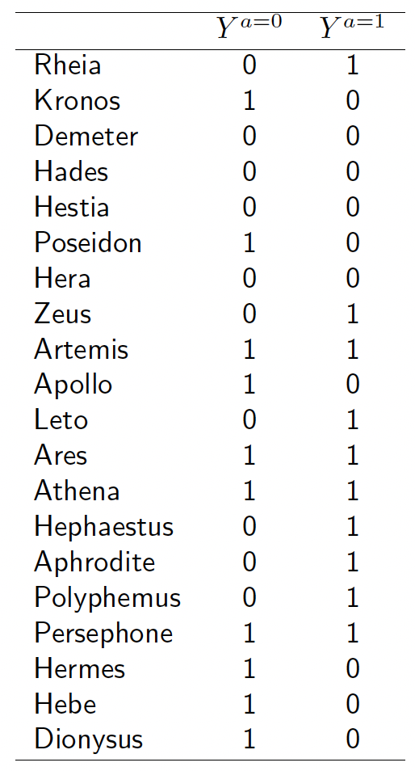
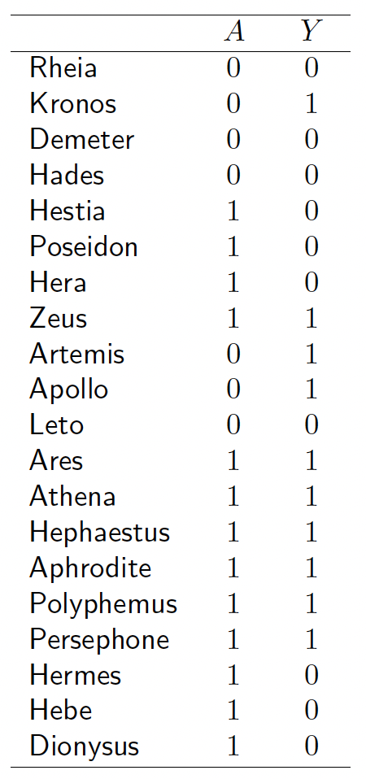

# Causality

Before starting Causality, it is good to start with the following papers:
## AI Can’t Reason Why
This is a nice article written by Judea Pearl and Dana Mackenzie in WSJ. [Link](https://www.wsj.com/articles/ai-cant-reason-why-1526657442)

__The current data-crunching approach to machine learning misses an essential element of human intelligence.__

Put simply, today’s machine-learning programs can’t tell whether a crowing rooster makes the sun rise, or the other way around. Whatever volumes of data a machine analyzes, it cannot understand what a human gets intuitively. From the time we are infants, we organize our experiences into causes and effects. The questions “Why did this happen?” and “What if I had acted differently?” are at the core of the cognitive advances that made us human, and so far are missing from machines.

Suppose, for example, that a drugstore decides to entrust its pricing to a machine learning program that we’ll call Charlie. The program reviews the store’s records and sees that past variations of the price of toothpaste haven’t correlated with changes in sales volume. So Charlie recommends raising the price to generate more revenue. A month later, the sales of toothpaste have dropped—along with dental floss, cookies and other items. Where did Charlie go wrong? Charlie didn’t understand that the previous (human) manager varied prices only when the competition did. When Charlie unilaterally raised the price, dentally price-conscious customers took their business elsewhere. The example shows that historical data alone tells us nothing about causes—and that the direction of causation is crucial.

Machine-learning systems have made astounding progress at analyzing data patterns, but that is the low-hanging fruit of artificial intelligence. To reach the higher fruit, AI needs a ladder, which we call the Ladder of Causation. Its rungs represent three levels of reasoning.

## Prediction or causality? A scoping review of their conflation within current observational research

This paper is published in 2021 in European Journal of Epidemiology. [Link](https://link.springer.com/article/10.1007/s10654-021-00794-w)

Causal and prediction research usually require different methods, and yet their findings may get conflated when reported and interpreted. The aim of the current study is to quantify the frequency of conflation between etiological and prediction research, to discuss common underlying mistakes and provide recommendations on how to avoid these.

## Effects of Causes and Causes of Effects
A nice paper published in 2022: [Link](https://www.annualreviews.org/doi/abs/10.1146/annurev-statistics-070121-061120)

We describe and contrast two distinct problem areas for statistical causality: studying the likely effects of an intervention ("effects of causes"), and studying whether there is a causal link between the observed exposure and outcome in an individual case ("causes of effects").

## Forecasting Causal Effects of Interventions versus Predicting Future Outcomes
[Link](https://www.tandfonline.com/doi/full/10.1080/10705511.2020.1780598)

# Definitions

## Reichenbach’s common cause principle
If two random variables $X$ and $Y$ are statistically dependent, then there exists a third variable $Z$ that causally influences both. As a special case, $Z$ may coincide with either $X$ or $Y$. Furthermore, this variable $Z$ screens $X$ and $Y$ from each other in the sense that given $Z$, they become independent.

## Notation
Let $Y^{a=1}$ (read $Y$ under treatment $a=1$) be the outcome variable that would have been observed under the treatment value $a=1$, and $Y^{a=0}$ (read $Y$ under treatment $a = 0$) the outcome variable that would have been observed under $A$ the treatment value $a = 0$.

We can now provide a formal definition of a causal effect for an individual: The treatment $A$ has a __causal effect__ on an individual's outcome $Y$ if $Y^{a=1} \ne Y^{a=0}$ for the individual.

Epidemiologists, statisticians, economists, and other social scientists refer to the __action__ $A$ as an __intervention__, an __exposure__, a __policy__, or a __treatment__.

The variables $Y^{a=1}$ and $Y^{a=0}$ are referred to as __potential outcomes__ or as __counterfactual outcomes__.

  

treatment $A$ (1 if the individual received a transplant, 0 otherwise) and outcome $Y$ (1 if the individual died, 0 otherwise).

For each individual, one of the counterfactual outcomes (the one that corresponds to the treatment value that the individual did receive) is actually factual. For example, because Zeus was actually treated $(A = 1)$, his counterfactual outcome under treatment $Y^{a=1} = 1$ is equal to his observed (actual) outcome $Y = 1$. That is, an individual with observed treatment $A$ equal to $a$, has observed outcome $Y$ equal to his counterfactual outcome $Y^a$. This equality can be succinctly expressed as $Y=Y^A$ where $Y^A$ denotes the counterfactual $Y^a$ evaluated at the value $a$ corresponding to the individual's observed treatment $A$. The equality $Y=Y^A$ is referred to as __consistency__.

Consistency: if $A_i = a$, then $Y^a_i = Y^A_i = Y_i$.

Individual causal effects are defined as a contrast of the values of counterfactual outcomes, but __only__ one of those outcomes is observed for each individual the one corresponding to the treatment value actually experienced by the individual. All other counterfactual outcomes remain __unobserved__.

## Interventions
Assume

$$C:= N_C$$

$$E:=4 C + N_E$$

with $N_C, N_E \sim N(0,1)$. Graphically,

$$C \rightarrow E.$$

Then

$$P_E = N(0,17)$$

$$P_E^{do(C:=2)} = P_{E|C=2} = N(8,1)$$

$$P_E^{do(C:=3)} = P_{E|C=3} = N(12,1)$$

and

$$P_C^{do(E:=100)} = N(0,1)$$

(no matter how much we whiten someone’s teeth, this will not have any effect on this person’s smoking habits)
similarly,

$$P_C^{do(E:=2)} = N(0,1) \neq P_{C|E=2} = N(8/17, 1/17).$$

proof of $P_{C|E=2}$ is based on the conditional multivariate normal distribution.

$do(E=2)$ sets $E=2$ in the graph, but conditional filters data having that condition.

## Causation versus association
When the proportion of individuals who develop the outcome in the treated $Pr[Y = 1|A = 1]$ equals the proportion of individuals who develop the outcome in the untreated $Pr[Y = 1|A = 0]$, we say that treatment $A$ and outcome $Y$ are __independent__, that $A$ is not associated with $Y$.

Causal inference requires data like the hypothetical data in Table 1.1, but all we can ever expect to have is real world data like those in Table 1.2. The question is then under which conditions real world data can be used for causal inference. The next chapter provides one answer: conduct a randomized experiment.

## Randomized experiments

## Observational studies

## Interventions

## Interaction
Suppose you know that carrying a lighter $A$ has no causal effect (causative or preventive) on anyone’s risk of lung cancer $Y$, i.e., $Pr[Y^{a=1} = 1] = Pr[Y^{a=0} = 1]$, and that cigarette smoking $L$ has a causal effect on both carrying a lighter $A$ and lung cancer $Y$. The causal diagram bellow is the graphical translation of this knowledge.

The lack of an arrow between $A$ and $Y$ indicates that carrying a lighter does not have a causal effect on lung cancer; $L$ is depicted as a common cause of $A$ and $Y$.

__Association__, unlike causation, is a symmetric relationship between two variables (an edge without direction); thus, when present, association flows between two variables regardless of the direction of the causal arrows.

We know that carrying a lighter $A$ has no causal effect on lung cancer $Y$. The question now is whether carrying a lighter $A$ is associated with lung cancer $Y$. That is, we know that $Pr[Y^{a=1} = 1] = Pr[Y^{a=0} = 1]$ but is it also true that $Pr[Y = 1 | A = 1] = Pr[Y = 1 | A = 0]$?

We learn that Hera is carrying a lighter. But if Hera is carrying a lighter $(A = 1)$, then it is more likely that she is a smoker $(L=1)$, and therefore she has a greater than average risk of developing lung cancer $(Y= 1)$. We then intuitively conclude that $A$ and $Y$ are expected to be associated because the cancer risk in those carrying a lighter $(A=1)$ is different from the cancer risk in those not carrying a lighter $(A=0)$, or $Pr[Y = 1|A = 1] \ne Pr[Y = 1|A = 0]$. In other words, having information about the treatment $A$ improves our ability to predict the outcome $Y$, even though $A$ does not have a causal effect on $Y$. The investigator will make a mistake if he concludes that $A$ has a causal effect on $Y$ just because $A$ and $Y$ are associated. Causal graphs theory again confirms our intuition. In graphic terms, $A$ and $Y$ are associated because there is a flow of association from $A$ to $Y$ (or, equivalently, from $Y$ to $A$) through the common cause $L$.

## collider

Suppose you know that certain genetic haplotype $A$ has no causal effect on anyone’s risk of becoming a cigarette smoker $Y$, i.e., $Pr[Y^{a=1} = 1] = Pr[Y^{a=0} = 1]$, and that both the haplotype $A$ and cigarette smoking $Y$ have a causal effect on the risk of heart disease $L$. The causal diagram bellow is the graphical translation of this knowledge.

The lack of an arrow between $A$ and $Y$ indicates that the haplotype does not have a causal effect on cigarette smoking, and $L$ is depicted as a common effect of $A$ and $Y$. The common effect $L$ is referred to as a __collider__ on the path $A \rightarrow L \leftarrow Y$ because two arrowheads collide on this node.

Now lets check whether A and Y are associated.
Learning about the haplotype $A$ does not improve our ability to predict the outcome $Y$ because the risk in those with $(A=1)$ and without $(A=0)$ the haplotype is the same, or $Pr[Y = 1|A = 1] = Pr[Y = 1|A = 0]$. In other words, we would intuitively conclude that $A$ and $Y$ are not associated, i.e., $A$ and $Y$ are independent.

Causal graphs theory again confirms our intuition because it says that colliders, unlike other variables, block the flow of association along the path on which they lie.

## mediator
Now suppose we obtain an additional piece of information: aspirin $A$ affects the risk of heart disease $Y$ because it reduces platelet aggregation $B$. This new knowledge is translated into the causal diagram of the following Figure  that shows platelet aggregation $B$ (1: high, 0: low) as a mediator of the effect of $A$ on $Y$.

## Confounding
__Confounding__ is the bias due to common causes of treatment and outcome. Bellow is the graph of a treatment $A$, an outcome $Y$, and their shared (or common) cause $L$.

## Selection bias

## propensity score

## Instrumental variables
The instrumental variable $z$ has the property that changes in
$z$ are associated with changes in $x$ but do not led to change in $y$ (aside from the indirect route via $x$). This leads to the following path diagram

which introduces a variable $z$ that is associated with $x$ but not $u$. It is still the case that $z$ and $y$ will be correlated, but the only source of such correlation is the indirect
path of $z$ being correlated with $x$ which in turn determines $y$.

### Examples of an Instrument

### Instrumental Variables Estimator

## counterfactual

## Causality and graphical models

## Causality and graphons

## Causality and mediators

# Casualty vs prediction
Casualty is identification, not prediction.
Predictive models can simply ignore the T variable during their learning process, while T is the most important factor.

# mediators vs moderators
A mediator variable explains the process through which two variables are related, while a moderator variable affects the strength and direction of that relationship.

https://psychdrop.com/2020/04/05/mediation-versus-moderation-whats-the-difference/

(add picture from the link)

Mediators mediate the relationship between X and Y. This occurs by X affecting M leading to M affecting Y, which is called the indirect effect. The direct effect is the relationship between X and Y in the presence of a mediator. Mediation occurs when (1) there is a statistically significant indirect effect (2) the direct effect is smaller than the total effect.

Moderator variables modify the relationship between X and Y. They affect the strength and direction of the relationship between X and Y. That means that X‘s effect on Y can change depending on the moderator.

# mediator vs confounder
A confounder is a third variable that affects variables of interest and makes them seem related when they are not. In contrast, a mediator is the mechanism of a relationship between two variables: it explains the process by which they are related.

Confounders are often demographic variables such as age, gender, and race that typically cannot be changed in an experimental design. Mediators are by definition capable of being changed and are often selected based on malleability. Suppressor variables may or may not be malleable.

# Mediating Variable Examples
According to research and data, the mortality rate of developed countries is lower than in developing countries because of advanced healthcare facilities. So, here, developed countries are the independent variable, the mortality rate is the dependent variable, and the mediator would be better healthcare facilities that navigate the relationship between both.

Being a developed country cannot influence its mortality rate directly. But after introducing the mediator here, which is better health care facilities, we can see an obvious effect of being a developed country and having a low mortality rate.

https://www.statisticshowto.com/mediator-variable/

# Causal, non-causal (acausal) and anti-causal systems
https://en.wikipedia.org/wiki/Causal_system

"Elements of Causal Inference" book has a good example in Figure 5.1.

# values
- average treatment effect (ATE)
- average treatment effect on the treated (ATT)
- treatment-on-the-treated (TOT) effect
- average treatment effect on the untreated (ATU)

The Cause Question: What is a cause of a given effect?
The Effect Question: What is an effect of a given cause?

problem of overdetermination and
the problem of preemption

# Causality and Recommendation system

# Reference
## Books

Causal Inference: What If, Miguel A. Hernán, James M. Robins, December 31, 2020
https://www.hsph.harvard.edu/miguel-hernan/causal-inference-book/

Quasi-Experimentation: A Guide to Design and Analysis, Charles S. Reichardt

Elements of Causal Inference: Foundations and Learning Algorithms, Jonas Peters, Dominik Janzing, and Bernhard Scholkopf

# key people

Judea Pearl

http://bayes.cs.ucla.edu/jp_home.html
Professor of Computer Science Department, Cognitive Systems Lab, UCLA

Miguel Hernan,

Kolokotrones Professor of Biostatistics and Epidemiology at Harvard and Broad Institute
https://www.hsph.harvard.edu/profile/miguel-hernan/

## videos
https://www.youtube.com/watch?v=gRkUhg9Wb-I&ab_channel=MITOpenCourseWare

https://www.youtube.com/watch?v=zvrcyqcN9Wo&ab_channel=BroadInstitute

# Causality data
## Medical Information Mart for Intensive Care
https://github.com/MIT-LCP/mimic-code
https://mimic.mit.edu/

# package
https://github.com/Microsoft/EconML
https://www.microsoft.com/en-us/research/group/alice/

## causalml - by uber
https://github.com/uber/causalml

They use ML for uplift modeling and they dont care about the causal graph, they more are intersted in the treatment effect. They are hevily dependent on the uplift model.

> It allows user to estimate the Conditional Average Treatment Effect (CATE) or Individual Treatment Effect (ITE) from experimental or observational data. Essentially, it estimates the causal impact of intervention $T$ on outcome $Y$ for users with observed features $X$, without strong assumptions on the model form.

### Uplift_modelling
https://en.wikipedia.org/wiki/Uplift_modelling

The uplift of a marketing campaign is usually defined as the difference in response rate between a treated group and a randomized control group.

However, many marketers define lift (rather than uplift) as the difference in response rate between treatment and control, so uplift modeling can be defined as improving (upping) lift through predictive modeling.

There are 4 groups
- The Persuadables : customers who only respond to the marketing action because they were targeted
- The Sure Things  : customers who would have responded whether they were targeted or not
- The Lost Causes  : customers who will not respond irrespective of whether or not they are targeted
- The Do Not Disturbs or Sleeping Dogs : customers who are less likely to respond because they were targeted

The only segment that provides true incremental responses is the Persuadables.

Uplift modelling provides a scoring technique that can separate customers into the groups described above.
(How?)

Traditional response modelling often targets the Sure Things being unable to distinguish them from the Persuadables.

### ref
- CausalML: Python Package for Causal Machine Learning https://arxiv.org/pdf/2002.11631
- Uplift Modeling for Multiple Treatments with Cost Optimization https://arxiv.org/pdf/1908.05372

## dowhy - by microsoft
https://github.com/py-why/dowhy

# Causal Calculus
https://www.cs.ubc.ca/labs/lci/mlrg/slides/doCalc.pdf

There is observational data (”seeing”) and interventional data (”doing”) Usually the DAG is designed for observational data, but that ignores the possibility of unobserved variables, also without interventional data you can’t distinguish the direction of causality.
Simplest external intervention: a single variable is forced to take some fixed value (in a graph remove arrows entering that variable)

## D-separation
”chain”, ”fork”, ”v-structure” or ”collider”

$A$ and $B$ are `d-separated`, give $C$, iff corresponding random variables are conditionally independent:
$$p(A, B|C) = p(A|C)p(B|C).$$

If $A$ and $B$ are not d-separated they are `d-connected`.

## do-calculus
`do()` operator marks an action or an intervention in the model. In an algebraic model we replace certain functions with a constant $X = x$, and in a graph we remove edges going into the target of intervention, but preserve edges going out of the target.

- Rule 1 (Insertion/deletion of observations)
- Rule 2 (Action/observation exchange)
- Rule 3 (Insertion/deletion of actions)

Goal is to generate probabilistic formulas for the effect of interventions in
terms of the observed probabilities.

Not all models are acyclic. See for example Modeling Discrete Interventional Data Using Directed Cyclic Graphical Models (UAI 2009) by Mark Schmidt and Kevin Murphy

The do-calculus is an axiomatic system for replacing probability formulas containing the do operator with ordinary conditional probabilities.

## Do-calculus adventures
https://www.andrewheiss.com/blog/2021/09/07/do-calculus-backdoors/

- Rule 1: Decide if we can ignore an observation
- Rule 2: Decide if we can treat an intervention as an observation
- Rule 3: Decide if we can ignore an intervention

